# VPN Site-to-Site Basada en Políticas — IPSec IKEv2

**Estudiante:** Junior Javier Santos Pérez  
**Matrícula:** 2024-1599  
**Plataforma:** PNETLab  

---

## Objetivo

Configurar una VPN Site-to-Site punto a punto basada en políticas (Policy-Based) utilizando IPSec con **IKEv2**, estableciendo un canal cifrado entre dos sitios remotos a través de Internet. El objetivo es garantizar la **confidencialidad**, **integridad** y **autenticación** del tráfico entre la LAN A (`10.15.99.0/24`) y la LAN B (`192.168.99.0/24`).

IKEv2 representa una evolución significativa respecto a IKEv1. Su proceso de negociación es más eficiente, completándose en **4 mensajes** en lugar de los 6 u 8 de IKEv1. Introduce mayor seguridad mediante el uso obligatorio de **IKEv2 Profiles** con keyrings independientes, soporte nativo para autenticación asimétrica, y mejor resistencia ante ataques de denegación de servicio. En una VPN Policy-Based con IKEv2, el tráfico cifrado sigue siendo definido por una **ACL**, pero el mecanismo de negociación del canal de control es completamente distinto al de IKEv1.

---

## Topología

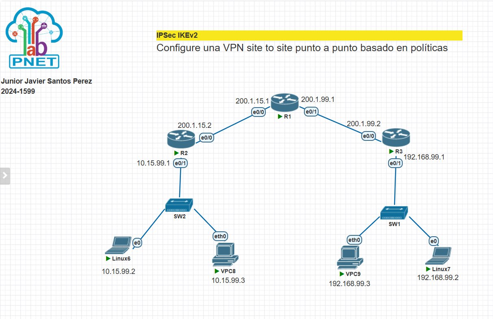

> Topología implementada en PNETLab. Misma estructura que IKEv1 — R1 actúa como ISP, R2 y R3 son los peers VPN con IKEv2. SW1 y SW2 son los switches de acceso de cada LAN.

### Dispositivos y direccionamiento IP

| Dispositivo | Rol | Interfaz | Dirección IP | Gateway |
|---|---|---|---|---|
| R1 (ISP) | Router de tránsito | e0/0 | 200.1.15.1/24 | — |
| R1 (ISP) | Router de tránsito | e0/1 | 200.1.99.1/24 | — |
| R2 | Peer 1 — Extremo LAN A | e0/0 | 200.1.15.2/24 | — |
| R2 | Peer 1 — Extremo LAN A | e0/1 | 10.15.99.1/24 | — |
| R3 | Peer 2 — Extremo LAN B | e0/0 | 200.1.99.2/24 | — |
| R3 | Peer 2 — Extremo LAN B | e0/1 | 192.168.99.1/24 | — |
| SW2 | Switch acceso LAN A | — | — | — |
| SW1 | Switch acceso LAN B | — | — | — |
| Linux6 | Host LAN A | e0 | 10.15.99.2/24 | 10.15.99.1 |
| VPC8 | Host LAN A | eth0 | 10.15.99.3/24 | 10.15.99.1 |
| Linux7 | Host LAN B | e0 | 192.168.99.2/24 | 192.168.99.1 |
| VPC9 | Host LAN B | eth0 | 192.168.99.3/24 | 192.168.99.1 |

### Enrutamiento estático

| Router | Red destino | Máscara | Next-Hop | Propósito |
|---|---|---|---|---|
| R2 | 192.168.99.0 | /24 | 200.1.15.1 | Alcanzar LAN B vía ISP |
| R2 | 200.1.99.0 | /24 | 200.1.15.1 | Alcanzar WAN de R3 vía ISP |
| R3 | 10.15.99.0 | /24 | 200.1.99.1 | Alcanzar LAN A vía ISP |
| R3 | 200.1.15.0 | /24 | 200.1.99.1 | Alcanzar WAN de R2 vía ISP |
| R1 | 10.15.99.0 | /24 | 200.1.15.2 | Reenviar tráfico hacia LAN A |
| R1 | 192.168.99.0 | /24 | 200.1.99.2 | Reenviar tráfico hacia LAN B |

---

## Parámetros de seguridad IPSec IKEv2

| Parámetro | Valor | Justificación |
|---|---|---|
| Protocolo IKE | IKEv2 | Versión moderna, negociación en 4 mensajes, más seguro |
| Cifrado Fase 1 | AES-CBC-256 | Cifrado simétrico de 256 bits de alta seguridad |
| Integridad / PRF | SHA-256 | Función pseudoaleatoria y hash de integridad |
| Autenticación | Pre-Shared Key (PSK) | Clave compartida definida en el IKEv2 Keyring |
| Grupo Diffie-Hellman | Grupo 14 (2048 bits) | Intercambio seguro de claves |
| Lifetime Fase 1 | 86400 segundos (24h) | Tiempo de vida de la IKEv2 SA |
| Transform Set | ESP-AES-256 + ESP-SHA256-HMAC | Cifrado + integridad del tráfico de datos |
| Modo del túnel | Tunnel | Encapsula el paquete IP original completo |
| Pre-shared Key | `1599vpn` | Definida en `crypto ikev2 keyring` |
| IKEv2 Profile | PROF-1599 | Vincula keyring + autenticación + identidad del peer |
| IKEv2 Proposal | PROP-1599 | Define cifrado, integridad y grupo DH |
| IKEv2 Policy | POL-1599 | Asocia la propuesta a la política global |
| IPSec Profile | IPSEC-PROF-1599 | Vincula transform-set con IKEv2 profile |
| Crypto Map | CMAP-1599v2 | Asocia peer, transform-set, IKEv2 profile y ACL |

---

## Diferencias clave entre IKEv1 e IKEv2

| Aspecto | IKEv1 | IKEv2 |
|---|---|---|
| Mensajes de negociación | 6 (Main Mode) | 4 siempre |
| Configuración PSK | `crypto isakmp key` | `crypto ikev2 keyring` |
| Política | `crypto isakmp policy` | `crypto ikev2 proposal` + `policy` |
| Perfil requerido | No | Sí — `crypto ikev2 profile` |
| Resistencia DoS | Menor | Mayor (cookies anti-DoS) |
| Autenticación asimétrica | No | Sí (local ≠ remote) |
| Verificación estado | `show crypto isakmp sa` | `show crypto ikev2 sa` |

---

## Scripts de configuración

### R1 — Router ISP

```
enable
configure terminal
hostname R-ISP
!
interface ethernet 0/0
 ip address 200.1.15.1 255.255.255.0
 no shutdown
!
interface ethernet 0/1
 ip address 200.1.99.1 255.255.255.0
 no shutdown
!
ip route 10.15.99.0 255.255.255.0 200.1.15.2
ip route 192.168.99.0 255.255.255.0 200.1.99.2
!
end
write memory
```

### R2 — Peer 1 (Extremo LAN A)

```
enable
configure terminal
hostname R2
!
interface ethernet 0/0
 ip address 200.1.15.2 255.255.255.0
 no shutdown
!
interface ethernet 0/1
 ip address 10.15.99.1 255.255.255.0
 no shutdown
!
ip route 192.168.99.0 255.255.255.0 200.1.15.1
ip route 200.1.99.0 255.255.255.0 200.1.15.1
!
! === FASE 1 — IKEv2 Proposal ===
crypto ikev2 proposal PROP-1599
 encryption aes-cbc-256
 integrity sha256
 group 14
exit
!
! === IKEv2 Policy ===
crypto ikev2 policy POL-1599
 proposal PROP-1599
exit
!
! === IKEv2 Keyring ===
crypto ikev2 keyring KR-1599
 peer R3
  address 200.1.99.2
  pre-shared-key 1599vpn
 exit
exit
!
! === IKEv2 Profile ===
crypto ikev2 profile PROF-1599
 match identity remote address 200.1.99.2 255.255.255.255
 authentication remote pre-share
 authentication local pre-share
 keyring local KR-1599
exit
!
! === FASE 2 — Transform Set ===
crypto ipsec transform-set TS-1599v2 esp-aes 256 esp-sha256-hmac
 mode tunnel
exit
!
! === IPSec Profile ===
crypto ipsec profile IPSEC-PROF-1599
 set transform-set TS-1599v2
 set ikev2-profile PROF-1599
exit
!
! === ACL — Tráfico interesante ===
ip access-list extended ACL-VPN-1599v2
 permit ip 10.15.99.0 0.0.0.255 192.168.99.0 0.0.0.255
exit
!
! === Crypto Map ===
crypto map CMAP-1599v2 10 ipsec-isakmp
 set peer 200.1.99.2
 set transform-set TS-1599v2
 set ikev2-profile PROF-1599
 match address ACL-VPN-1599v2
exit
!
! === Aplicar en interfaz WAN ===
interface ethernet 0/0
 crypto map CMAP-1599v2
exit
!
end
write memory
```

### R3 — Peer 2 (Extremo LAN B)

```
enable
configure terminal
hostname R3
!
interface ethernet 0/0
 ip address 200.1.99.2 255.255.255.0
 no shutdown
!
interface ethernet 0/1
 ip address 192.168.99.1 255.255.255.0
 no shutdown
!
ip route 10.15.99.0 255.255.255.0 200.1.99.1
ip route 200.1.15.0 255.255.255.0 200.1.99.1
!
! === FASE 1 — IKEv2 Proposal ===
crypto ikev2 proposal PROP-1599
 encryption aes-cbc-256
 integrity sha256
 group 14
exit
!
! === IKEv2 Policy ===
crypto ikev2 policy POL-1599
 proposal PROP-1599
exit
!
! === IKEv2 Keyring ===
crypto ikev2 keyring KR-1599
 peer R2
  address 200.1.15.2
  pre-shared-key 1599vpn
 exit
exit
!
! === IKEv2 Profile ===
crypto ikev2 profile PROF-1599
 match identity remote address 200.1.15.2 255.255.255.255
 authentication remote pre-share
 authentication local pre-share
 keyring local KR-1599
exit
!
! === FASE 2 — Transform Set ===
crypto ipsec transform-set TS-1599v2 esp-aes 256 esp-sha256-hmac
 mode tunnel
exit
!
! === IPSec Profile ===
crypto ipsec profile IPSEC-PROF-1599
 set transform-set TS-1599v2
 set ikev2-profile PROF-1599
exit
!
! === ACL — Tráfico interesante ===
ip access-list extended ACL-VPN-1599v2
 permit ip 192.168.99.0 0.0.0.255 10.15.99.0 0.0.0.255
exit
!
! === Crypto Map ===
crypto map CMAP-1599v2 10 ipsec-isakmp
 set peer 200.1.15.2
 set transform-set TS-1599v2
 set ikev2-profile PROF-1599
 match address ACL-VPN-1599v2
exit
!
! === Aplicar en interfaz WAN ===
interface ethernet 0/0
 crypto map CMAP-1599v2
exit
!
end
write memory
```

---

## Capturas de configuración y verificación

### 1. R2 — `show ip route`

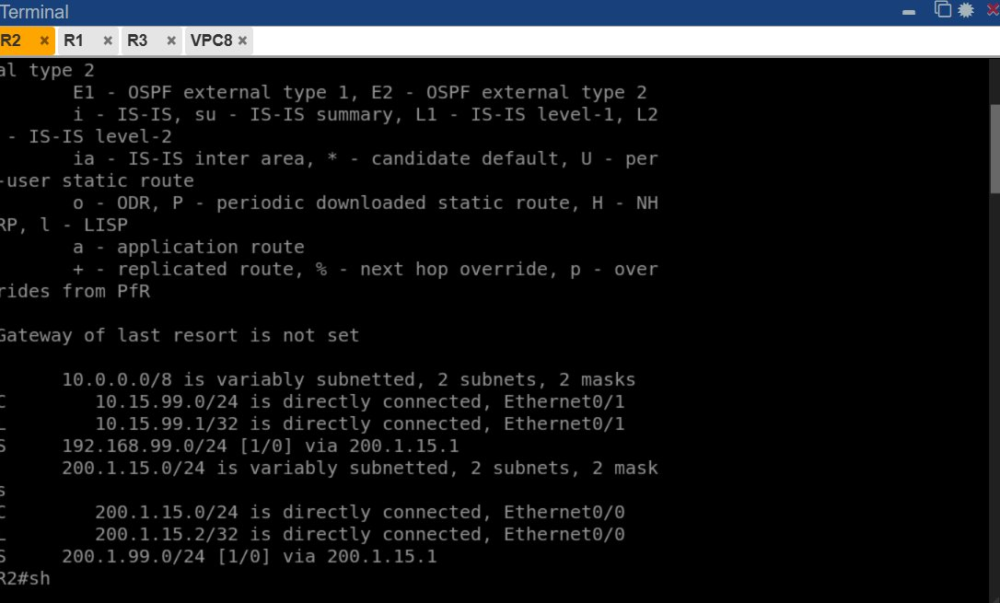

Tabla de enrutamiento de R2:
- `C 10.15.99.0/24` — red LAN A conectada directamente en `Ethernet0/1`.
- `S 192.168.99.0/24 via 200.1.15.1` — ruta estática hacia LAN B a través del ISP.
- `S 200.1.99.0/24 via 200.1.15.1` — ruta hacia la WAN de R3 a través del ISP.

---

### 2. R2 — `show crypto ikev2 sa` — IKEv2 SA activa

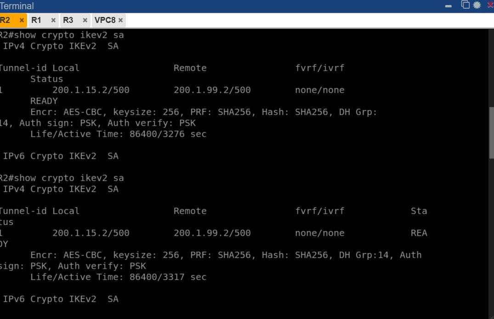

El comando `show crypto ikev2 sa` confirma que la **negociación IKEv2 fue exitosa**:
- `Tunnel-id 1` — identificador único del túnel.
- `Local: 200.1.15.2/500` — dirección WAN local de R2.
- `Remote: 200.1.99.2/500` — dirección WAN de R3.
- `Status: READY` — IKEv2 SA completamente negociada y activa.
- `Encr: AES-CBC, keysize: 256` — cifrado AES-256 confirmado.
- `PRF: SHA256, Hash: SHA256` — integridad SHA-256 confirmada.
- `DH Grp: 14` — Diffie-Hellman grupo 14 (2048 bits).
- `Auth sign: PSK, Auth verify: PSK` — autenticación por clave precompartida.
- `Life/Active Time: 86400/3276 sec` — lifetime de 24h, activo hace ~54 minutos.

---

### 3. R2 — `show crypto session` y `show crypto ipsec sa`

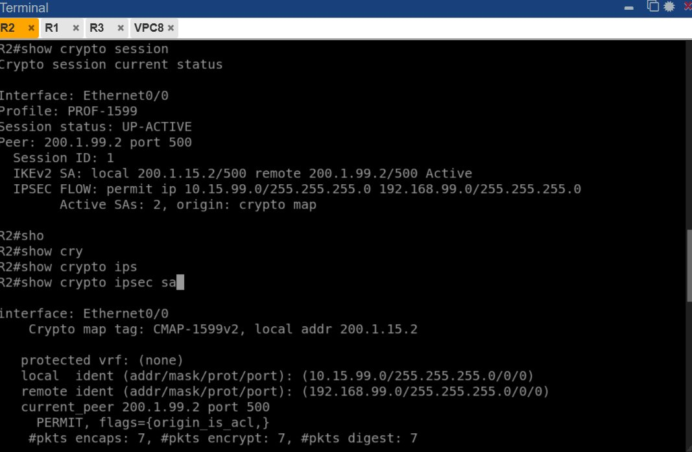

`show crypto session` muestra:
- `Profile: PROF-1599` — perfil IKEv2 activo en la sesión.
- `Session status: UP-ACTIVE` — sesión completamente activa.
- `IKEv2 SA: local 200.1.15.2/500 remote 200.1.99.2/500 Active`.
- `IPSEC FLOW: permit ip 10.15.99.0/255.255.255.0 192.168.99.0/255.255.255.0` — flujo correcto.
- `Active SAs: 2` — dos SAs activas (inbound + outbound).

`show crypto ipsec sa` muestra:
- Crypto map `CMAP-1599v2` activo en `Ethernet0/0`.
- `local ident: 10.15.99.0` — red origen protegida.
- `remote ident: 192.168.99.0` — red destino protegida.
- `#pkts encaps: 7, #pkts encrypt: 7` — 7 paquetes cifrados.

---

### 4. R2 — `show running-config | section crypto`

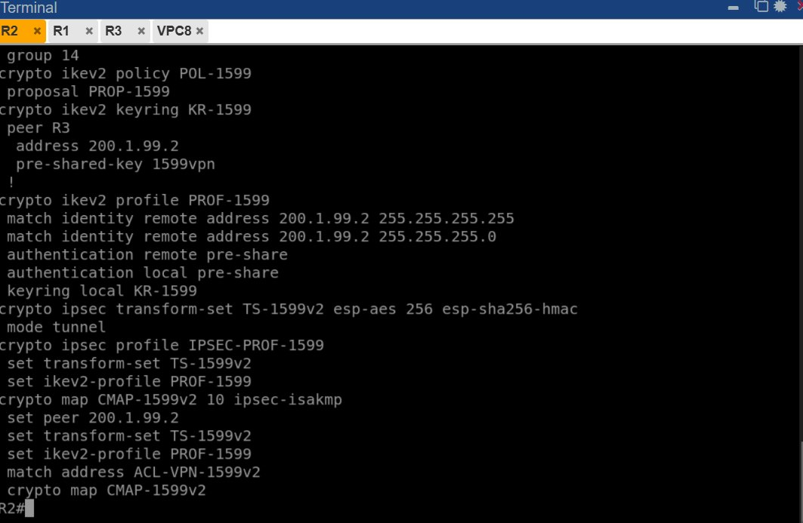

Confirma la configuración completa IKEv2 en R2:
- `crypto ikev2 proposal PROP-1599` con `group 14`.
- `crypto ikev2 policy POL-1599` con `proposal PROP-1599`.
- `crypto ikev2 keyring KR-1599` con peer R3 en `200.1.99.2` y `pre-shared-key 1599vpn`.
- `crypto ikev2 profile PROF-1599` con `match identity remote address 200.1.99.2`.
- `crypto ipsec transform-set TS-1599v2 esp-aes 256 esp-sha256-hmac` en `mode tunnel`.
- `crypto ipsec profile IPSEC-PROF-1599` vinculado al IKEv2 profile.
- `crypto map CMAP-1599v2` con peer, transform-set, ikev2-profile y ACL.

---

### 5. R1 (ISP) — `show ip route`

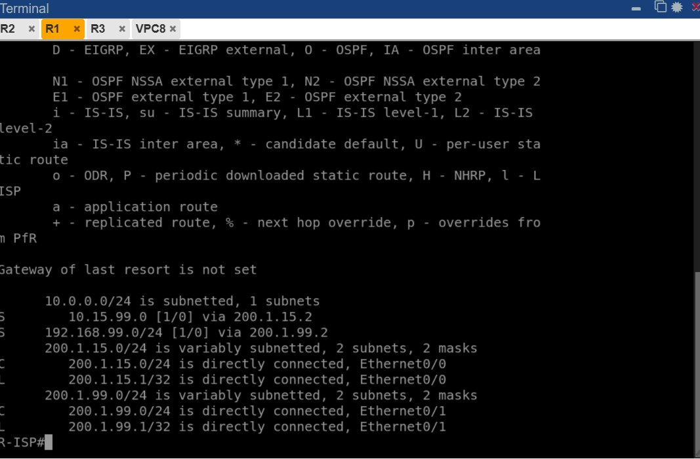

El ISP tiene rutas estáticas hacia ambas LANs privadas:
- `S 10.15.99.0/24 via 200.1.15.2` — hacia LAN A a través de R2.
- `S 192.168.99.0/24 via 200.1.99.2` — hacia LAN B a través de R3.
- Interfaces `Ethernet0/0` y `Ethernet0/1` directamente conectadas.

---

### 6. R3 — `show ip route`

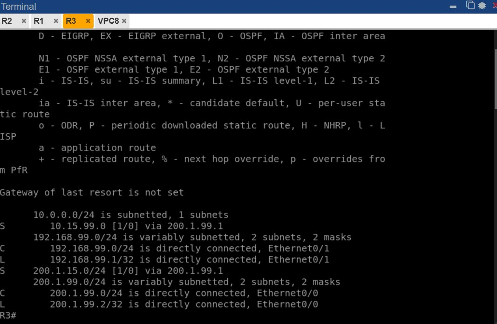

Tabla de enrutamiento de R3:
- `C 192.168.99.0/24` — red LAN B conectada directamente en `Ethernet0/1`.
- `S 10.15.99.0/24 via 200.1.99.1` — ruta estática hacia LAN A a través del ISP.
- `S 200.1.15.0/24 via 200.1.99.1` — ruta hacia la WAN de R2 a través del ISP.

---

### 7. R3 — `show crypto ikev2 sa` y `show crypto session`

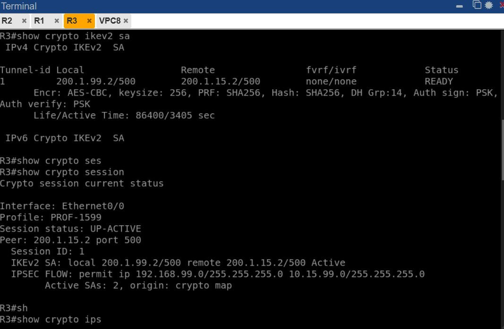

Verificación desde el lado de R3:
- `Status: READY` — IKEv2 SA activa en R3.
- `Local: 200.1.99.2/500, Remote: 200.1.15.2/500` — peers correctos.
- `Encr: AES-CBC, keysize: 256, PRF: SHA256, DH Grp:14` — mismos parámetros que R2.
- `Life/Active Time: 86400/3405 sec` — activo hace ~57 minutos.
- `Session status: UP-ACTIVE` en `show crypto session`.
- `Profile: PROF-1599` — perfil IKEv2 activo.
- `IKEv2 SA: local 200.1.99.2/500 remote 200.1.15.2/500 Active`.
- `IPSEC FLOW: permit ip 192.168.99.0/255.255.255.0 10.15.99.0/255.255.255.0`.

---

### 8. R3 — `show crypto ipsec sa`

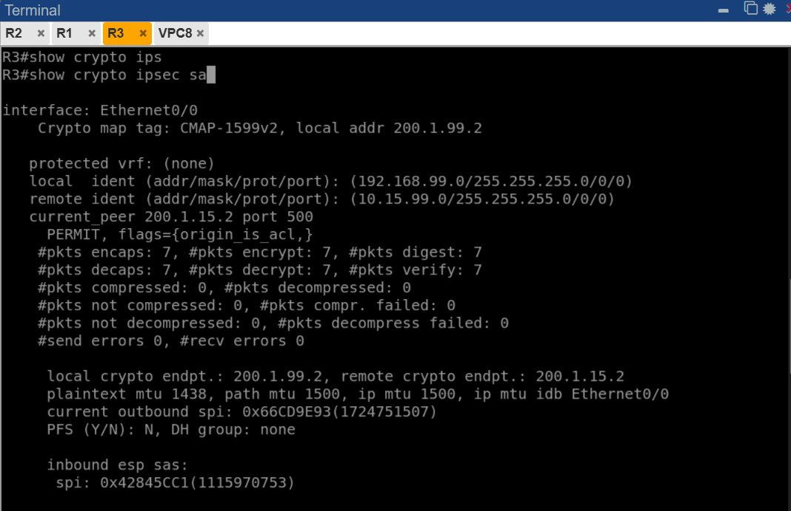

Desde R3 se confirma:
- Crypto map `CMAP-1599v2` activo en `Ethernet0/0`.
- `local ident: 192.168.99.0` — red origen de R3.
- `remote ident: 10.15.99.0` — red destino LAN A.
- `#pkts encaps: 7, #pkts encrypt: 7, #pkts digest: 7` — 7 paquetes cifrados.
- `#pkts decaps: 7, #pkts decrypt: 7, #pkts verify: 7` — 7 paquetes descifrados.
- `#send errors 0, #recv errors 0` — sin errores.
- SPI inbound y outbound activos — SAs simétricas establecidas.

---

### 9. R3 — `show running-config | section crypto`

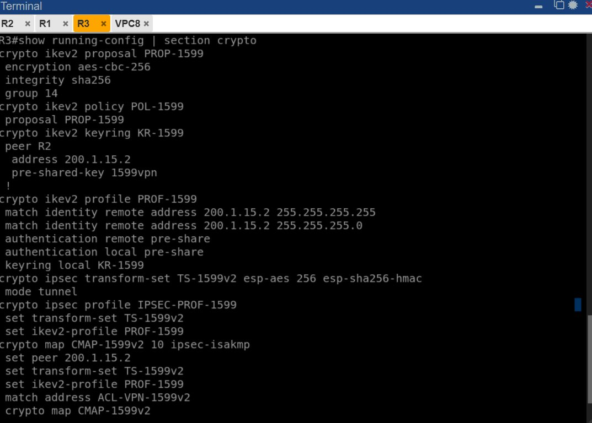

Confirma la configuración completa IKEv2 en R3:
- `crypto ikev2 proposal PROP-1599` con `encryption aes-cbc-256`, `integrity sha256`, `group 14`.
- `crypto ikev2 policy POL-1599` con `proposal PROP-1599`.
- `crypto ikev2 keyring KR-1599` con peer R2 en `200.1.15.2` y `pre-shared-key 1599vpn`.
- `crypto ikev2 profile PROF-1599` con `match identity remote address 200.1.15.2`.
- `crypto ipsec transform-set TS-1599v2 esp-aes 256 esp-sha256-hmac` en `mode tunnel`.
- `crypto map CMAP-1599v2` con `set ikev2-profile PROF-1599` y `match address ACL-VPN-1599v2`.

---

## Pruebas de conectividad

### VPC9 (LAN B) → VPC8 (LAN A)

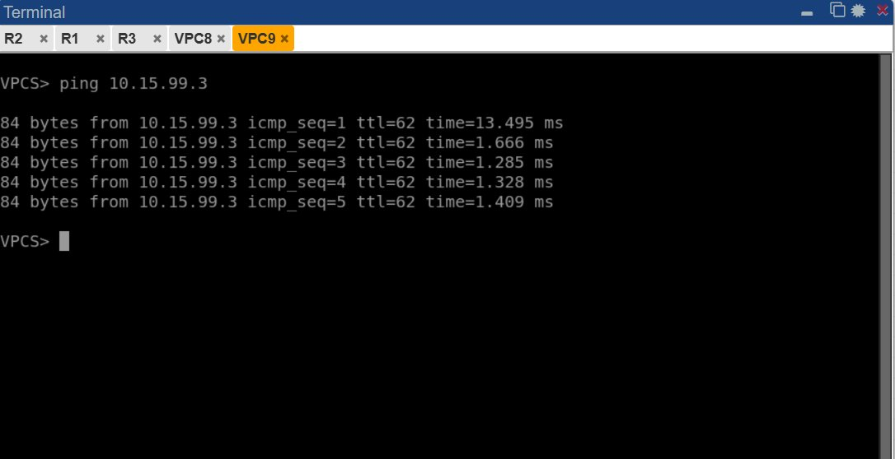

`ping 10.15.99.3` ejecutado desde VPC9 (`192.168.99.3`) hacia VPC8 (`10.15.99.3`):
- 5 respuestas exitosas con TTL=62.
- TTL=62 confirma que el tráfico atraviesa 2 routers (R3 → R2) a través del túnel IPSec IKEv2.
- Tiempo de respuesta estable: ~1-13 ms.

---

### VPC8 (LAN A) → VPC9 (LAN B)

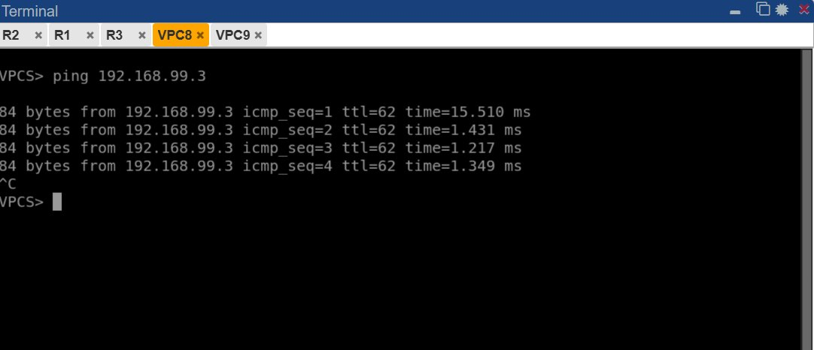

`ping 192.168.99.3` ejecutado desde VPC8 (`10.15.99.3`) hacia VPC9 (`192.168.99.3`):
- 4 respuestas exitosas con TTL=62.
- Conectividad bidireccional confirmada.
- El túnel IPSec IKEv2 funciona correctamente en ambas direcciones.

---

## Resumen de resultados

| Verificación | Comando | Resultado |
|---|---|---|
| IKEv2 SA R2 | `show crypto ikev2 sa` | ✅ READY — AES-256/SHA256/DH14 |
| IKEv2 SA R3 | `show crypto ikev2 sa` | ✅ READY — AES-256/SHA256/DH14 |
| IPSec SA R2 | `show crypto ipsec sa` | ✅ 7 pkts encaps/decrypt |
| IPSec SA R3 | `show crypto ipsec sa` | ✅ 7 pkts encaps/decrypt |
| Sesión R2 | `show crypto session` | ✅ UP-ACTIVE — PROF-1599 |
| Sesión R3 | `show crypto session` | ✅ UP-ACTIVE — PROF-1599 |
| Enrutamiento R2 | `show ip route` | ✅ Rutas estáticas correctas |
| Enrutamiento R3 | `show ip route` | ✅ Rutas estáticas correctas |
| Enrutamiento R1 | `show ip route` | ✅ Rutas hacia ambas LANs |
| Ping VPC9 → VPC8 | `ping 10.15.99.3` | ✅ Exitoso (TTL=62, 5/5) |
| Ping VPC8 → VPC9 | `ping 192.168.99.3` | ✅ Exitoso (TTL=62, 4/4) |
